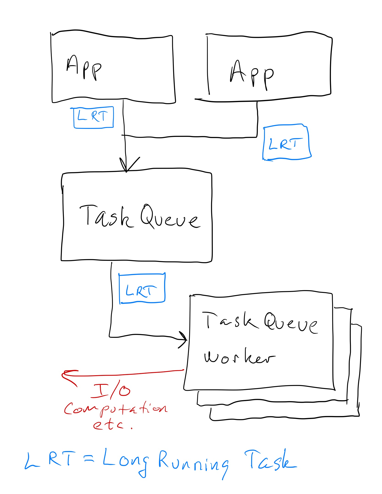
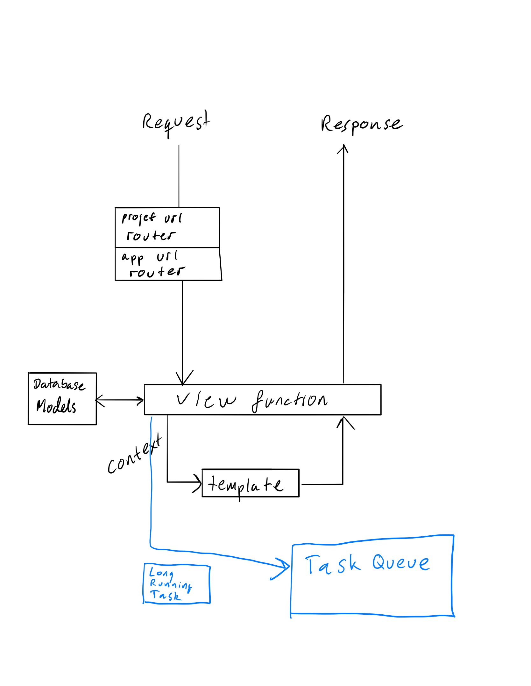

# MkGif Project

## Task queue

A task queue is a queue of tasks to be executed. The queue accepts tasks from one process on a computer and allows that task to be run by another process. That process could be run on the same computer or another computer.
Usually the tasks are **_long running_** tasks wich take a long time to complete.

Typically these **_long running_** tasks are :

- I/O: Network communication
- Computation: CPU intensive tasks

The problem with **_long running_** tasks is that they are blocking the thread they are running on. This means that the thread cannot be used to do other work while the task is running. This is a problem because we want to be able to do other work while the task is running.

In web development we are especially concerned with the issue of blocking, because we cant present the user with a response until the task is complete. This means that the user will have to wait for the task to complete before they can continue using the application.

## Task Queues in Django

In Django we are particularly interested in handing off long running tasks from the view functions. This is because the view function can't return a response if a task is blocking the thread - nothing is returned to the user until the view function can return the response.

To avoid this, we make use of task queues.

